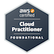
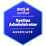
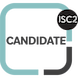
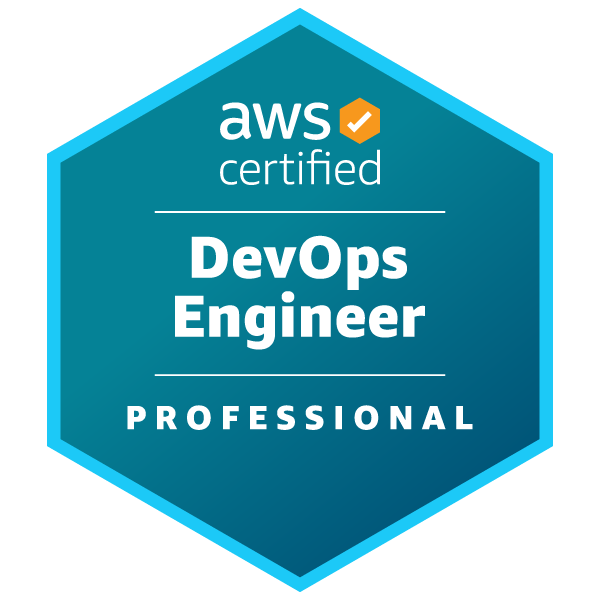

### Hi there 👋

[.png)](https://www.credly.com/badges/affa3a55-687b-4017-9970-d0251e53576d/public_url)

#

<!--
**sphakamiso-git/sphakamiso-git** is a ✨ _special_ ✨ repository because its `README.md` (this file) appears on your GitHub profile.

Here are some ideas to get you started:

- 🔭 I’m currently working on ...
- 🌱 I’m currently learning ...
- 👯 I’m looking to collaborate on ...
- 🤔 I’m looking for help with ...
- 💬 Ask me about ...
- 📫 How to reach me: ...
- 😄 Pronouns: ...
- ⚡ Fun fact: ...
-->
